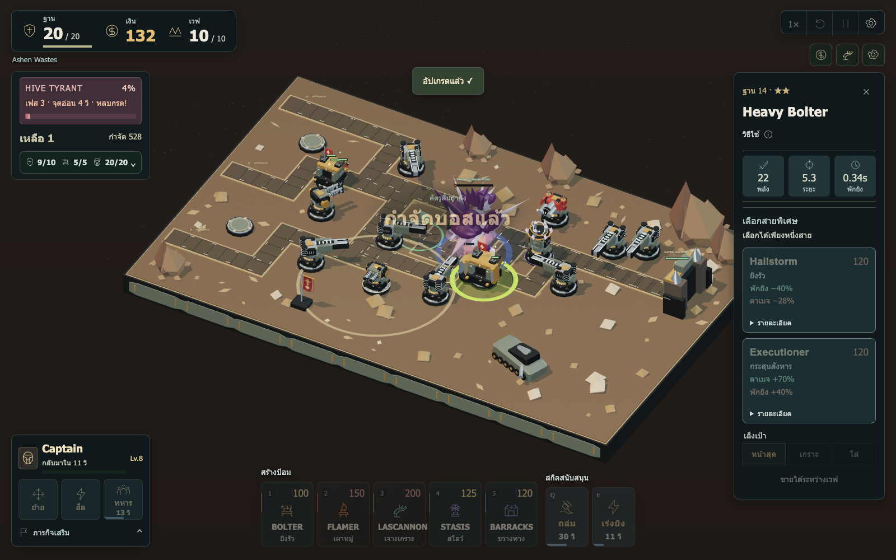
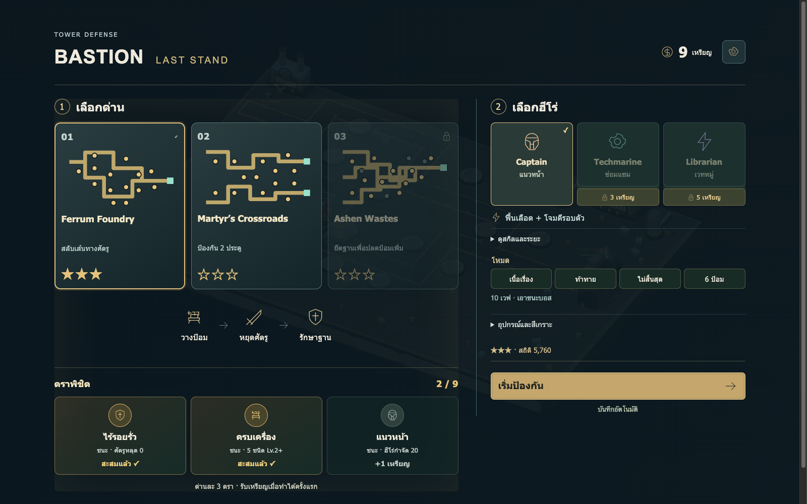

# Bastion — Last Stand

**A grimdark 3D tower defense game built with Three.js.**

สร้างแนวป้อม สั่งฮีโร่เข้าช่วย และรักษาฐานจากฝูง Tyranids ในเกม Tower Defense ธีม Warhammer 40,000 ที่ได้แรงบันดาลใจด้านการเล่นจาก Kingdom Rush เล่นผ่านเบราว์เซอร์ พร้อม UI ภาษาไทยและชื่อหน่วยรบภาษาอังกฤษ

[เวอร์ชันบน Sites](https://bastion-last-stand.asdpoommail.chatgpt.site) · [คู่มือการเล่น](docs/GAMEPLAY.md) · [รายงานปัญหา](https://github.com/TanatipWa/bastion-last-stand/issues)

> เวอร์ชันบน Sites จำกัดสิทธิ์การเข้าถึงไว้ที่บัญชีเจ้าของ ผู้ที่ไม่มีสิทธิ์สามารถ clone แล้วรันบนเครื่องตามขั้นตอนด้านล่าง



## จุดเด่น

- **3 สมรภูมิ** — สลับเส้นทางในโรงงาน ป้องกันสองประตู และยึดฐานกลางทะเลทราย
- **5 ป้อม / 10 สายอัปเกรด** — เลือกยิงฝูง เจาะเกราะ เผาพื้นที่ สโลว์ หรือส่ง Marines ขวางทาง
- **3 ฮีโร่** — Captain, Techmarine และ Librarian มีบทบาทและสกิลต่างกัน
- **4 โหมด** — เนื้อเรื่อง 10 เวฟ, ท้าทาย, ไม่สิ้นสุด และจำกัด 6 ป้อม
- **เล่นซ้ำด้วยแผนใหม่** — เลือก Doctrine, รับภารกิจเสริม, ปลดล็อกอุปกรณ์และเก็บตราพิชิต 9 ตรา
- **ภาพและเสียงจากโค้ด** — ฉากและโมเดล Three.js พร้อมเสียงสังเคราะห์ ไม่ต้องดาวน์โหลดชุดโมเดลหรือใส่ API key

มีความเร็ว 1×/2×, ปรับเสียงและคุณภาพภาพ, ลดการเคลื่อนไหว และบันทึกความคืบหน้าในเบราว์เซอร์

<details>
<summary>ดูหน้าจอเลือกด่านและตราพิชิต</summary>



</details>

## เริ่มเล่นบนเครื่อง

ใช้ **Node.js 22.12 ขึ้นไป**, npm และเบราว์เซอร์ที่รองรับ **WebGL 2** แนะนำเมาส์และคีย์บอร์ดสำหรับการสั่งหลายหน่วยระหว่างต่อสู้

```sh
git clone https://github.com/TanatipWa/bastion-last-stand.git
cd bastion-last-stand
npm ci
npm run dev
```

เปิด URL ที่ Vite แสดงใน Terminal โดยปกติคือ **http://127.0.0.1:5173** ใช้ `Ctrl+C` เพื่อหยุดเซิร์ฟเวอร์

ไม่ต้องตั้งค่า `.env`, ฐานข้อมูล หรือบริการ backend ตัวเกมต้องเปิดผ่านเว็บเซิร์ฟเวอร์ การดับเบิลคลิก `index.html` โดยตรงไม่ใช่วิธีรันที่รองรับ

## วิธีเล่นในหนึ่งนาที

1. เริ่มที่ **Ferrum Foundry → Captain → เนื้อเรื่อง**
2. คลิกฐานวงกลมแล้วเลือกป้อม หรือเลือกการ์ดป้อมแล้วคลิกฐาน
3. เริ่มเวฟ ใช้เงินจากการสังหารสร้างและอัปเกรดแนวป้องกัน
4. ย้ายฮีโร่ เรียกทหาร และใช้สกิลช่วยจุดที่ศัตรูกำลังผ่าน
5. เลือกพลังเสริมหลังเวฟ 3, 6 และ 9 แล้วเอาชนะบอสในเวฟ 10

ป้อมทุกชนิดอัปเกรดได้ถึงระดับ 3 โดยระดับสุดท้ายต้องเลือกหนึ่งในสองสาย ชนะด่านก่อนหน้าในโหมดเนื้อเรื่องเพื่อปลดล็อกด่านถัดไป และผ่านด่านแรกเพื่อเปิดโหมดเพิ่มเติม

## การควบคุม

| การกระทำ | ปุ่ม / วิธีใช้ |
| --- | --- |
| เลือก Bolter / Flamer / Lascannon / Stasis / Barracks | `1` / `2` / `3` / `4` / `5` แล้วคลิกฐาน |
| อัปเกรด เลือกเป้าหมาย หรือขายป้อม | คลิกป้อมแล้วใช้แผงรายละเอียด; ขายได้ระหว่างเวฟ |
| ย้ายฮีโร่ | `H` แล้วคลิกพื้นที่ หรือคลิกขวาเมื่อไม่ได้เล็งคำสั่งอื่น |
| สกิลฮีโร่ | `F` แล้วคลิกเป้าหมายในระยะ |
| เรียกกำลังเสริม | `G` แล้วคลิกถนน |
| Orbital Barrage | `Q` แล้วคลิกพื้นที่ |
| Overcharge | `E` แล้วคลิกป้อมโจมตี |
| ย้ายจุดรวมพล Marines | เลือก Barracks → ปุ่มจุดรวมพล → คลิกถนน |
| ยกเลิกคำสั่งที่กำลังเล็ง | `Esc` หรือคลิกขวา |
| พักเกม / เล่นต่อ | `Space` เพื่อพัก; ใช้ปุ่มเล่นต่อในเมนู |
| เลื่อน / ซูม / คืนมุมกล้อง | `WASD` / ลูกกลิ้งเมาส์ / `R` |

## ด่านและโหมด

| ด่าน | สิ่งที่ต้องวางแผน |
| --- | --- |
| **01 · Ferrum Foundry** | จ่ายเงินสลับเส้นทางระหว่างเวฟเพื่อใช้แนวป้อมให้คุ้ม |
| **02 · Martyr’s Crossroads** | รักษาสองประตู หากประตูใดหมดเลือดจะแพ้ |
| **03 · Ashen Wastes** | ส่งฮีโร่ยึดฐานเพื่อเปิดจุดสร้างเพิ่ม และรับมือสามทางบุก |

| โหมดในเกม | รูปแบบ |
| --- | --- |
| **เนื้อเรื่อง** | ป้องกัน 10 เวฟและเอาชนะบอส |
| **ท้าทาย** | ศัตรูมากขึ้น แข็งแกร่งขึ้น และบุกถี่ขึ้น |
| **ไม่สิ้นสุด** | เล่นต่อหลังเวฟ 10 และจบรอบเพื่อเก็บคะแนนระหว่างพัก |
| **6 ป้อม** | ใช้เฉพาะ Bolter, Lascannon และ Barracks รวมไม่เกิน 6 ป้อม |

อ่านรายละเอียดป้อม ฮีโร่ พลังเสริม และวิธีรับมือศัตรูได้ใน [คู่มือการเล่น](docs/GAMEPLAY.md)

## เซฟเกม

เกมบันทึกรอบที่เล่นอัตโนมัติทุก 5 วินาทีและเมื่อออกคำสั่ง รีโหลดแล้วกด **เล่นต่อ** เพื่อกลับเข้าสู่เกมในสถานะพัก การเริ่มรอบใหม่จะแทนที่เซฟรอบเดิม ส่วนเหรียญ สิ่งที่ปลดล็อก สถิติ และตราพิชิตเก็บในโปรไฟล์

ข้อมูลอยู่ใน `localStorage` ของเบราว์เซอร์ ไม่มี cloud sync: คนละเครื่อง คนละเบราว์เซอร์ หรือคนละ origin จะมีเซฟแยกกัน รวมถึง `localhost`, `127.0.0.1`, พอร์ตที่ต่างกัน และ URL บน Sites การล้างข้อมูลเว็บไซต์จะลบเซฟของ origin นั้น

## Build และนำขึ้นเว็บ

```sh
npm run build
npm run preview
```

`build` ตรวจ TypeScript แล้วสร้าง production assets ด้วย Vite ส่วน `preview` เปิดผลลัพธ์สำหรับตรวจบนเครื่อง โดยปกติที่ **http://127.0.0.1:4173** ทั้งสองคำสั่งไม่รัน unit tests

นำไฟล์ **ภายใน `dist/` ทั้งหมด** ไปวางบน static hosting ได้ โดยให้ `index.html` อยู่ที่ root ของเว็บไซต์ ไม่มีขั้นตอนรัน Node.js บน production server

หากโฮสต์ใต้ subpath เช่น GitHub Pages แบบ project site ให้กำหนด base path ตอน build:

```sh
npm run build -- --base=/bastion-last-stand/
```

การ push ขึ้น GitHub เพียงอย่างเดียวไม่ได้เปิด GitHub Pages หรืออัปเดต Sites อัตโนมัติ ต้องตั้งค่าการ deploy ของบริการที่เลือกแยกต่างหาก

## โครงสร้างโปรเจกต์

```text
src/
├── game/       กติกา เวฟ AI หน่วยรบ ความคืบหน้า และเซฟ
├── render/     ฉาก โมเดล แสง เอฟเฟกต์ กล้อง และเสียง
├── ui/         HUD เมนู แคมเปญ และหน้าผลลัพธ์
├── main.ts     Input, game loop และการเชื่อมระบบ
└── style.css   รูปแบบ UI และ responsive layout
public/         ไฟล์ static เช่น favicon
docs/           คู่มือและภาพตัวอย่าง
index.html      หน้าเริ่มต้นของ Vite
```

ใช้ **TypeScript + Three.js + Vite** และ DOM/CSS สำหรับ UI ระบบจำลองเดินด้วย fixed timestep 60 ครั้งต่อวินาที แยกกติกาเกมจากการวาดภาพ ไฟล์ `*.test.ts` เดิมยังอยู่ใน source และถูกแยกออกจาก production type check

## รายงานปัญหาหรือร่วมพัฒนา

เปิด [Issue](https://github.com/TanatipWa/bastion-last-stand/issues) พร้อมชื่อด่าน โหมด ฮีโร่ เวฟที่พบปัญหา เบราว์เซอร์ และภาพประกอบถ้ามี สำหรับ PR ระบุสิ่งที่เปลี่ยนและวิธีตรวจ โดยตรวจ `npm run build` และลองพฤติกรรมที่เกี่ยวข้องในเบราว์เซอร์

## เกี่ยวกับโปรเจกต์

นี่คือ **fan game ที่ไม่เป็นทางการ** และไม่มีส่วนเกี่ยวข้องกับ Games Workshop ชื่อ Warhammer 40,000 และชื่อที่เกี่ยวข้องเป็นของเจ้าของสิทธิ์ที่เกี่ยวข้อง โมเดล ฉาก และเสียงของเกมนี้สร้างจากโค้ดในโปรเจกต์
